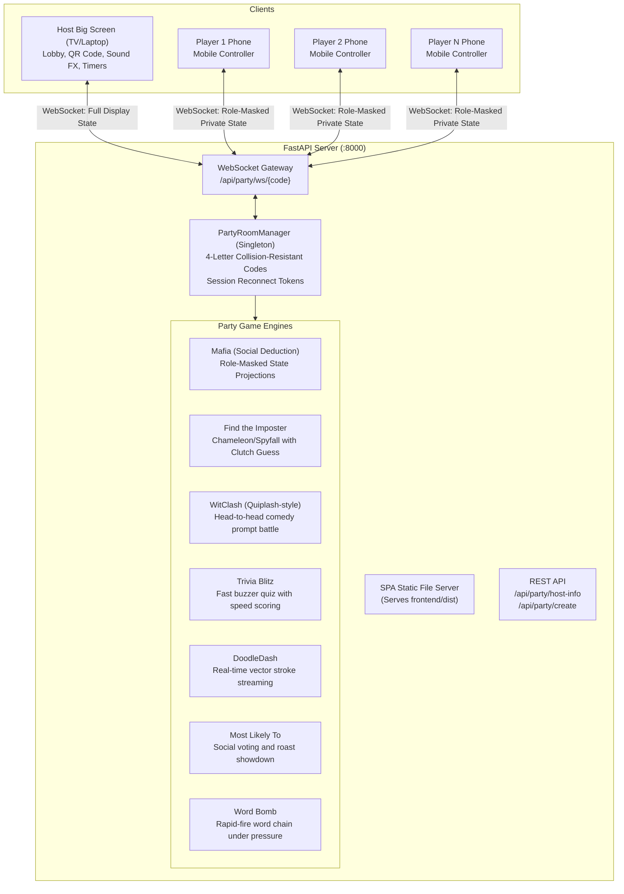

# System Architecture

## 1. Overview & Couch Co-Op Architecture

Sanfun is a unified web arcade and couch co-op party game engine. It features both single-player/local-2P canvas arcade games and a full **Jackbox-style Couch Party Game Platform** where a laptop/PC acts as the Big Screen TV/Monitor host and players join using smartphones as wireless controllers.

## 2. Security & Anti-Cheat Invariants
1. **Strict Role-Masked State Projections**:
   - In social deduction games (**Mafia**, **Find the Imposter**), broadcast state is individually filtered on the server before transmission.
   - Villagers never receive the Mafia roster or night kill targets in WebSocket packets.
   - Imposters never receive the secret word payload.
   - Host TV screen conceals hidden phase choices (e.g. night targets and secret words) to prevent screen-peeking.
2. **Session Reconnection Tokens**:
   - Every joining player receives a UUID session token stored in browser `localStorage`.
   - If a player's phone screen sleeps or reloads, they re-authenticate and re-bind to their role and seat without disrupting the room.
3. **Unified Single-Port Hosting**:
   - The FastAPI backend directly serves the pre-compiled `frontend/dist` static assets and WebSocket connections over port `8000`.
   - Players on local Wi-Fi only connect to `http://<host-ip>:8000/?join=CODE` with zero cross-origin issues.

## 3. Network Discovery & Zero-Config Tunneling
- **Local LAN Auto-Discovery**: `app/party/network.py` detects the host's routable IPv4 address and dynamically embeds it into an inline SVG QR code on the TV.
- **Docker Compose**: Containerized multi-stage build running the entire platform in a single container.
- **Remote Internet Bridge**: Includes optional Cloudflare Tunnel (`cloudflared`) profile in `docker-compose.yml` for remote friends across the internet without router port forwarding.

## 4. Frontend & Controller Architecture
1. **Party Lounge Portal**: Landing hub enabling quick host creation and phone joining via room code.
2. **Party Controller Engine**: Touch-optimized mobile UI with contextual screens (Mafia kill/heal/investigate buttons, Imposter peek cards, WitClash prompt inputs, Trivia 4-shape buzzers, DoodleDash drawing canvas, Most Likely voting chips, Word Bomb rapid input).
3. **Web Audio API Synthesizer**: Zero-dependency procedural synth producing 8-bit retro arcade sounds (join blips, timer ticks, gongs, victory fanfares) offline.

